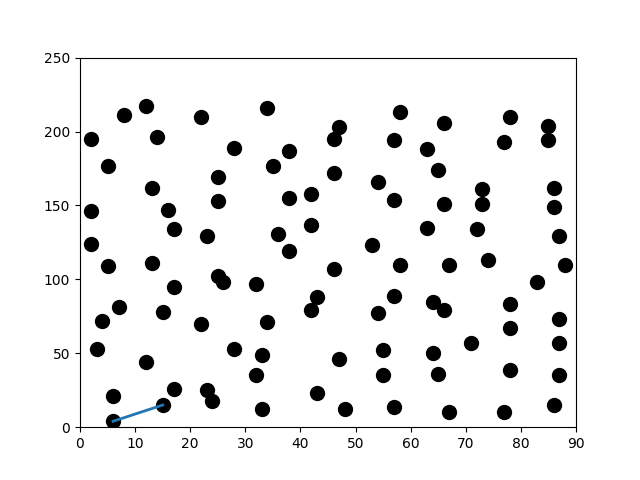

 
As part of this school project. We have a role -playing game as a project group

Introduction:

This project emerged from the need to address the global concern for energy consumption and greenhouse gas emissions. The goal was to leverage technology to improve transportation methods, making them more economical and less polluting. As part of this initiative, the French Environment and Energy Management Agency (ADEME) launched a call for demonstrations of new mobility solutions.

Project Description:

Working in a team of four at CesiCDP, a leading company in the field of Intelligent Multimodal Mobility, we aimed to respond to ADEME's call by focusing on optimizing delivery tour planning. The challenge was to calculate a route that allows for connecting a subset of cities on a road network, then returning to the starting point, while minimizing total travel time and considering predicted traffic.

We used methods from Operations Research to devise an optimized delivery tour. The problem's scope was flexible, allowing us to explore various additional constraints such as delivery time windows, truck capacities, specific item delivery requirements, and traffic variation over time. These constraints served to enhance the problem's realism and relevance.

<pre>
constraints:

Tools and methods:

Pythons

Notebook jupyter

using at minimum the TSP problem with big instance or TSP and add constraints.

Language, Framework:

Pythons

Code readability and maintainability:

English-speaking subsidiaries must be able to use all documents, lines of code and comments.

Each function must contain a reasonable number of lines of code.

Redundant lines of code should be avoided (pay particular attention when copying and pasting).

Compliance with naming conventions.

Version control.

Limiting duplicate lines of code as much as possible.
</pre>

For more information :
Source: <a href="https://github.com/yannsadowski/Algorithm_mTSP"><i class="large github icon "></i>yannsadowski/easysave</a>

