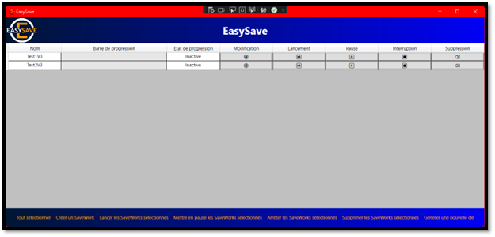

Backup software for businesses with file encryption capability.

<pre>
constraints:

Tools and methods:

Visual Studio 2019 version 16.3 or later - Git Azure DevOps.

UML editor, with recommended use of ArgoUML.

“All your documents and all your code should be managed in these tools.”

“Your manager (tutor or course director) must receive an invite to your Git repository to be able to follow your developments.”

Language, Framework:

C#.

Net.Core 3.X library.

Code readability and maintainability:

English-speaking subsidiaries must be able to use all documents, lines of code and comments.

Each function must contain a reasonable number of lines of code.

Redundant lines of code should be avoided (pay particular attention when copying and pasting).

Compliance with naming conventions.

Other constraints:

The user documentation should be no longer than one page.

There should be a mandatory release note.

You are required to manage this project in such a way as to reduce the development costs of future versions and especially to be able to react quickly to any feedback concerning a dysfunction.

Version control.

Limiting duplicate lines of code as much as possible.
</pre>

Source: <a href="https://github.com/yannsadowski/easysave"><i class="large github icon "></i>yannsadowski/easysave</a>
