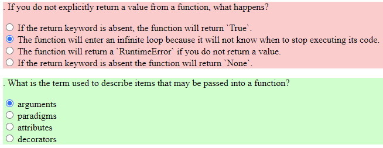

 
As part of this project, we aimed to help users prepare for LinkedIn's skill assessments by providing a platform to practice these quizzes.

Introduction:

The simulateQCM project is a tool designed for simulating multiple-choice quizzes (MCQs) based on LinkedIn's skill assessment quizzes. The project directly utilizes quizzes from the linkedin-skill-assessments-quizzes repository as the source for the MCQ simulations.

Project Description:

The questions are sourced from the quizzes file in the linkedin-skill-assessments-quizzes repository, which is then converted into a JSON format by the Python script "qcmtoJSON.py". This script generates a "FileName.json" file containing all quiz questions in a readily usable format. The "index.html" file serves as the user interface for taking the quiz​1​.

Tools and methods:

Python, HTML, JavaScript

Code readability and maintainability:

The code is written in English, ensuring readability and maintainability across different teams. All documents, lines of code, and comments are in English. Each function contains a reasonable number of lines of code, and redundant lines of code are avoided.

Compliance with naming conventions and version control is maintained. Duplicate lines of code are limited as much as possible.

For more information :
Source: <a href="https://github.com/yannsadowski/simulateQCM"><i class="large github icon "></i>yannsadowski/simulateQCM</a>
